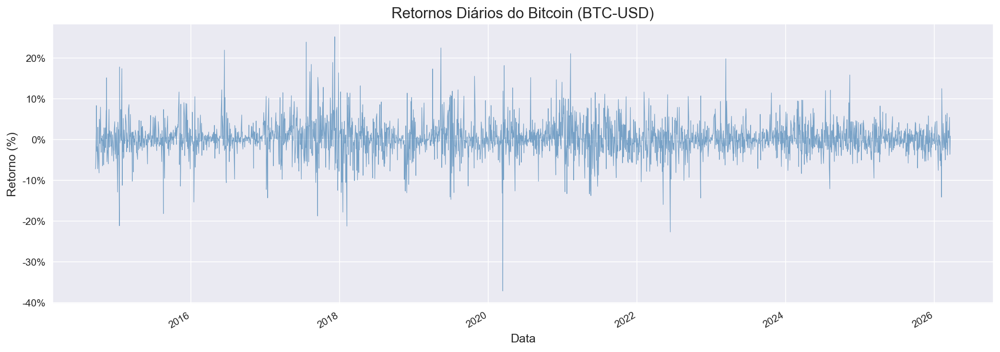
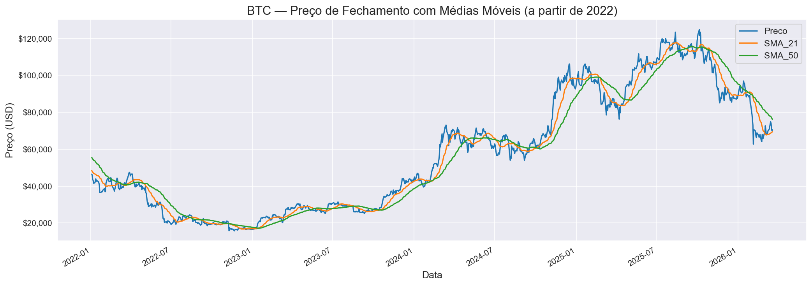
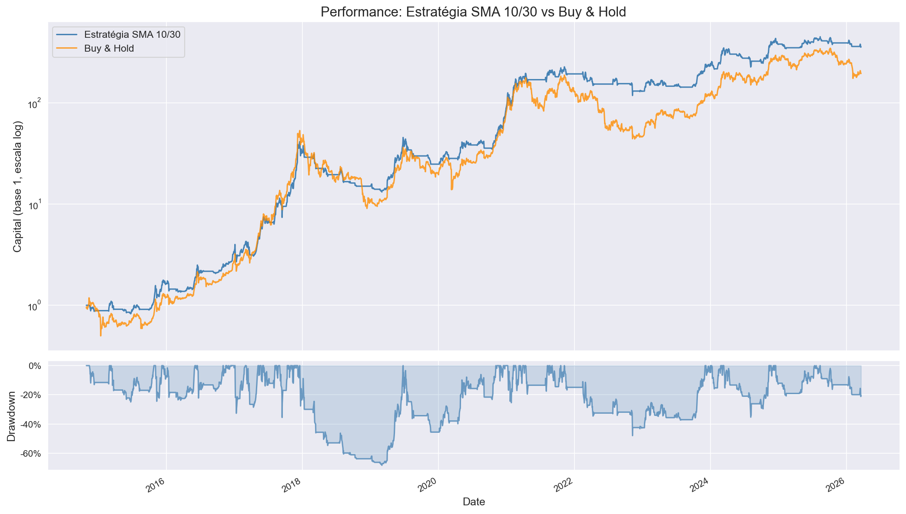
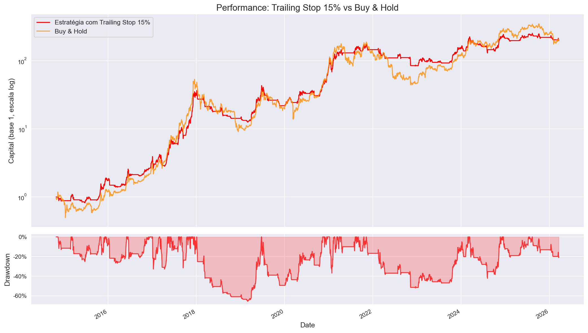

# Bitcoin Market Analysis & Quantitative Strategy Evaluation

## Executive Summary

This project analyzes the historical behavior of Bitcoin (BTC-USD) and evaluates whether systematic trading rules can improve **risk management** compared to a passive **Buy and Hold** strategy.

The objective is to compare quantitative strategies using backtesting, drawdown analysis and risk-adjusted return metrics.

Key takeaways:
- Bitcoin presents extremely high daily volatility and deep drawdowns.
- Trend-following strategies act mainly as risk control mechanisms rather than return maximizers.
- Transaction costs significantly affect short-term strategies.
- The correlation between Bitcoin and the S&P 500 is dynamic, varying significantly across different market regimes.

> This is not a trading bot. The goal is to study how quantitative analysis can be used to evaluate behavior and risk in volatile assets.

---

## Research Questions

- How volatile is Bitcoin on a daily basis?
- Does Bitcoin behave independently from traditional markets?
- Can trend-following rules reduce exposure during bear markets?
- Can risk management techniques reduce drawdowns without eliminating upside?
- How does the BTC/S&P 500 correlation evolve over time?

---

## Data Source

Historical daily price data was obtained programmatically using the **Yahoo Finance API (yfinance)**.

Assets analyzed:
- Bitcoin (BTC-USD)
- S&P 500 index

The dataset is automatically downloaded to ensure reproducibility.

---

## Methodology

### Exploratory Data Analysis
- Daily returns calculation
- Volatility visualization
- Distribution of returns
- Comparison with S&P 500 behavior

### Trend-Following Strategy
Moving-average crossover strategies were implemented using multiple window combinations to identify market regimes.

Signals:
- Long when short moving average crosses above long moving average
- Exit when crossover reverses

### Backtesting
- Strategy equity curve calculation
- Comparison with buy-and-hold performance
- Cumulative return analysis
- Multiple parameter combinations tested

### Risk Management
- Trailing stop-loss
- Exposure reduction during downtrends
- Drawdown mitigation

### Rolling Correlation Analysis
- 30, 90 and 180-day rolling Pearson correlation between BTC and S&P 500
- Identifies regime shifts in diversification potential

---

## Results

### Daily Returns Distribution


Bitcoin shows extremely high volatility with frequent large positive and negative daily returns.

### Moving Averages Trend Identification


Moving averages help identify prolonged bull and bear regimes and act as systematic entry/exit signals.

### Strategy vs Buy and Hold


Trend-following strategies avoid large portions of prolonged downturns, while buy-and-hold achieves higher absolute returns during strong bull cycles.

### Trailing Stop Risk Control


Applying a trailing stop-loss reduces major drawdowns while maintaining participation in upward trends.

---

## Key Findings

- Bitcoin is a high-volatility asset unsuitable for passive investors with low risk tolerance.
- Trend-following rules primarily improve risk management.
- Buy-and-hold offers higher long-term return but with severe drawdowns.
- Systematic strategies reduce time spent in bear markets.
- Trailing stop-loss improves downside protection.
- BTC/S&P 500 correlation is highly dynamic: it ranges from strongly positive during broad market sell-offs to near-zero or negative, making Bitcoin an unreliable diversifier.

---

## Skills Demonstrated

- Financial data collection via API (yfinance)
- Data cleaning and preprocessing (Pandas)
- Time series analysis
- Backtesting methodology
- Risk metrics calculation (volatility, drawdown, Sharpe ratio, Sortino ratio, Calmar ratio)
- Rolling correlation analysis (BTC vs S&P 500)
- Financial data visualization (Matplotlib / Seaborn)

---

## Technical Stack

- Python
- pandas
- numpy
- matplotlib / seaborn
- yfinance
- scipy

---

## How to Run

1. Install dependencies

```bash
pip install -r requirements.txt
```

2. Open the notebook

```bash
jupyter notebook bitcoin_market_analysis.ipynb
```

The notebook downloads the data automatically.
